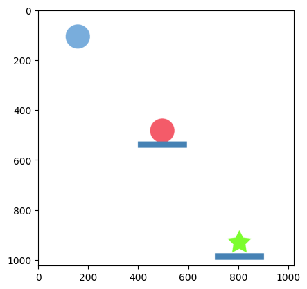

# Multi-task-Reinforcement-Learning-for-Physical-Reasoning

<div align="justify">
In real-world applications several tasks have to be solved simultaneously and Reinforcement learning (RL) has been successful in solving these complex tasks in various domains which includes robotics, game playing, and natural language processing. Training RL agent to solve a specific task is often challenging and asking the same agent to generalize well to variations of the same task is a bigger.

In this work, we take a task, create multiple variations of it and see if a RL agent can learn these variations to solve the given puzzle. CREATE has a lot of physics based puzzle and for our use case we have chosen the one shown in the below image. The aim here is to make the red ball reach the green target using the blue ball and the different tools CREATE provides. The agent should adapt to the variations of the tasks and generalize to solve the puzzle with the right tools.

We go ahead and experiment with model-free (**IMPALA**) and model-based (**PLANET**) reinforcement learning algorithms. The agent architectures are slightly modified to fit to our use case.
</div>

<div align="center">

</div>

**Papers**
- IMPALA
    - Paper: https://arxiv.org/abs/1802.01561
    - Github: https://github.com/Sheepsody/Batched-Impala-PyTorch
- PLANET 
    - Paper: https://arxiv.org/abs/1811.04551
    - Github: https://github.com/abhayraw1/planet-torch

To reproduce the results, make sure that below requirements are satisified
```commandline
- Operating System: Ubuntu 20+
- Python: 3.7
- Torch: Cuda-Python specific torch
```

**Results (Multi-Task)**
- Model-free | Model-based

<div align="center">

</div>

- O/p of Transition Model from PlaNet
Left gif is the Ground-Truth. Right gif is the o/p of transition model
<div align="center">
    
</div>

**Results (Single-Task)**
- Model-free | Model-based
<div align="center">

</div>

- Agent solving the puzzle - Multi-Task
<div align="center">
    
    
    
</div>

- Agent solving the puzzle - Single Task
<div align="center">
    
    
</div>

- Agent failing to solve the puzzle
<div align="center">
    
</div>

